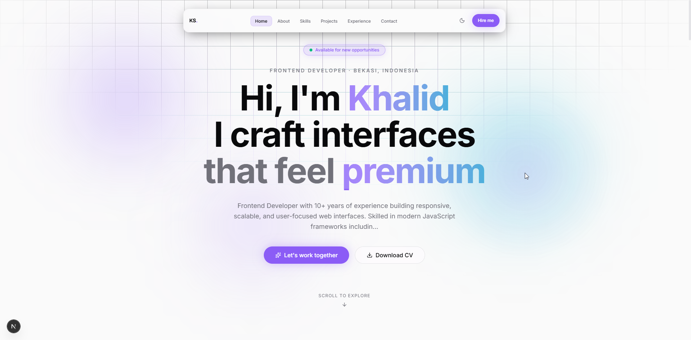

# 🚀 Khalid Portfolio

Modern frontend developer portfolio built with Next.js, Tailwind CSS, TypeScript, and Framer Motion.



## ✨ Features

- Modern UI/UX
- Responsive Design
- Smooth Animations
- Dark Mode
- Interactive Project Cards
- Glassmorphism Effects
- Scroll Reveal Animations
- SEO Optimized

## 🛠 Tech Stack

- Next.js
- TypeScript
- Tailwind CSS
- Framer Motion
- Shadcn UI
- Lucide React

## 📂 Project Structure

```bash
app/
components/
data/
public/
styles/
lib/
```

## ⚡ Getting Started

Clone the project:

```bash
git clone https://github.com/YOUR_USERNAME/khalid-portfolio.git
```

Install dependencies:

```bash
npm install
```

Run development server:

```bash
npm run dev
```

Build production:

```bash
npm run build
```

## 🌐 Live Demo

[View Portfolio](https://portfolio-khalid-seven.vercel.app/)


## 📬 Contact

- Email: kholidsudrajat@email.com
- LinkedIn: https://www.linkedin.com/in/kholidsudrajat/
- GitHub: https://github.com/bowwsudrajat

---

Made with ❤️ by Khalid Sudrajat